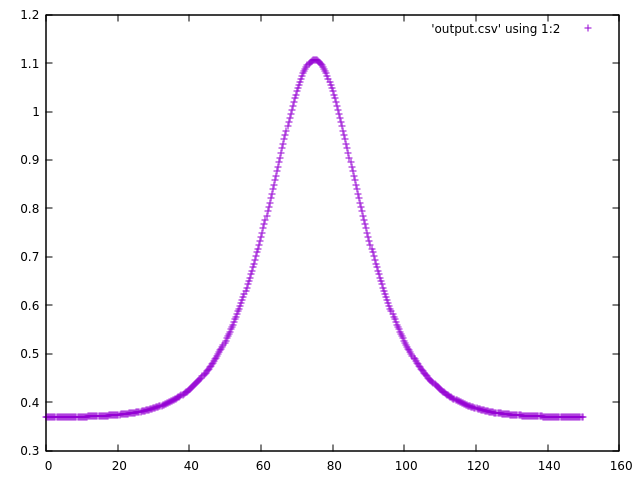
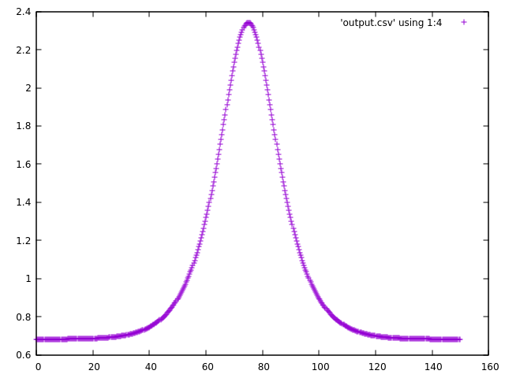

# Pseudo Spectral 1D Chain for homopolymer

This is an implementation of the Pseudo spectral method following the works
of Gleen H. Fredrickson - The Equilibrium Theory of Inhomogenous Polymers in
C++ using Section 3.6.3.

Dependencies:
- FFTW3
- CMake
- g++

# Build instructions (Linux)

mkdir build \
cd build \
cmake .. \
make 

# Running instructions (Linux)

cd build \
./single_chain

This will then dump all of the 'useful' data into an output.csv from which can
be post processed in other software such as GNUPlot, this currently just describes the
Chain end distribution function q(x,N), first column being the x position, second
being the aforementioned distribution function and last column being the scaled potential
function.

# Program output

For a externally applied field given by

Nw(x)= (1.0  - 2.0 * pow(sech(3.0 * (x - L / 2.0)/ (2 * R_g)),2.0))

With chain length of 10, 512 integration steps, delta s = 10/512, 512 grid points in the x direction, initial q of 1.0, 15 as the chain gyration radius, box length of 10 and delta x as 10 R_g / 512.
Produces the following plots, q plot of
\
 
\
and a density plot of \
\

